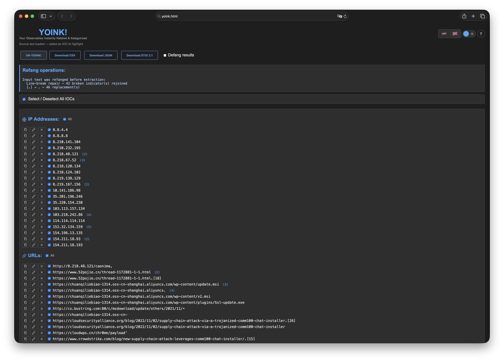
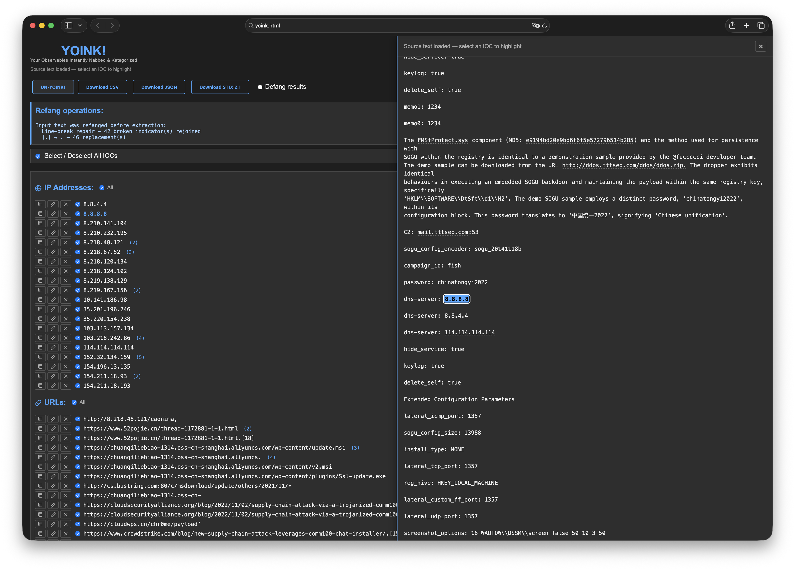
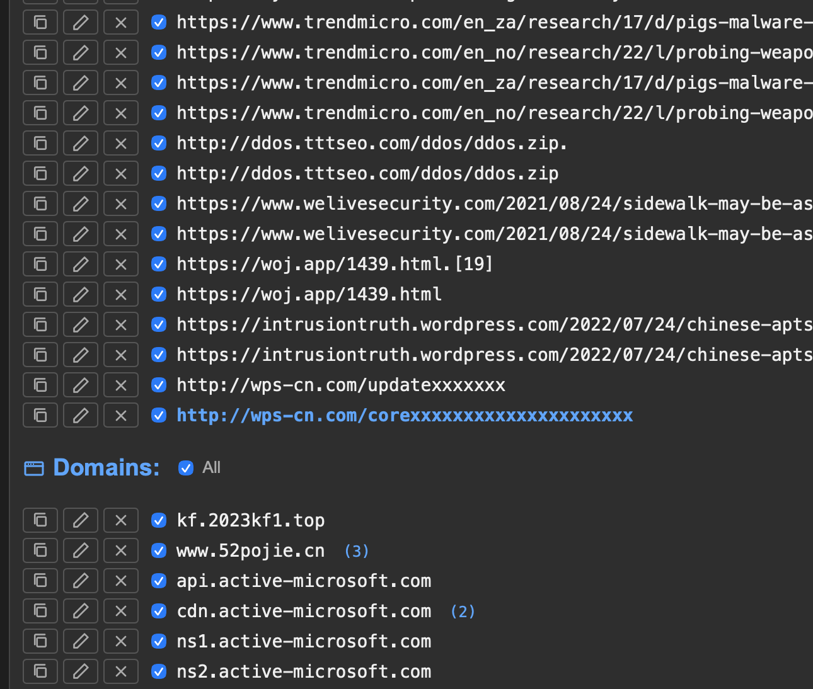
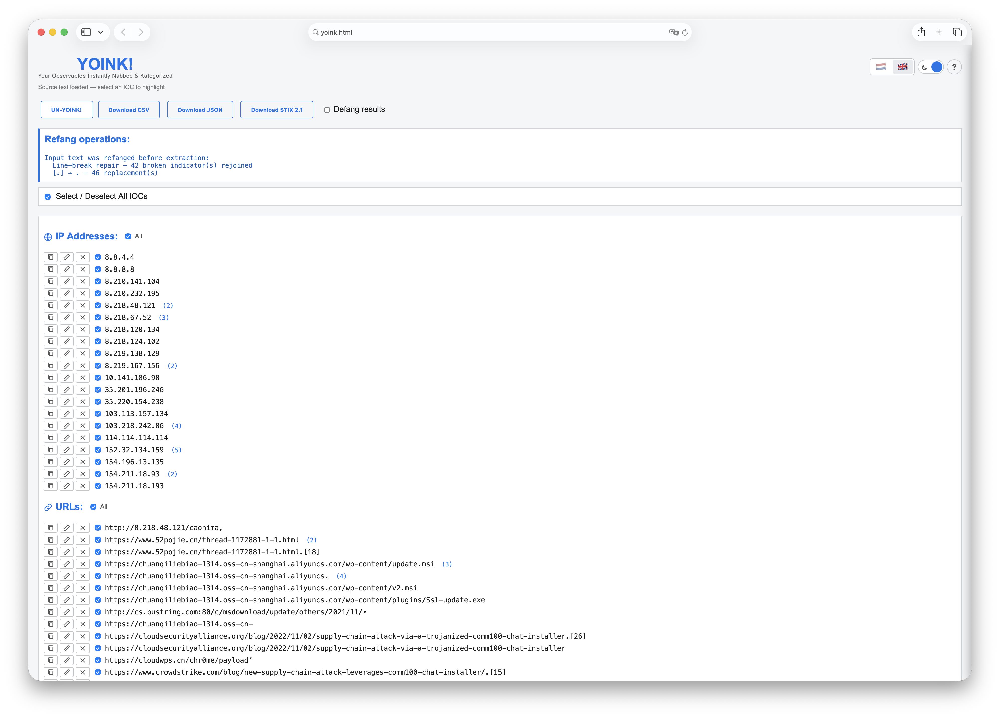

# YOINK!

### Your Observables Instantly Nabbed & Kategorized

> A zero-dependency, single-file HTML tool that yoinks Indicators of Compromise out of raw text. Extract, defang, edit, and export to CSV, JSON, or STIX 2.1 — all from one file you can run anywhere.



---

## Why YOINK?

During incident response and threat intelligence work, you constantly copy-paste IOCs from reports, emails, sandboxes, and logs. Most of the time you need to:

- Pull IOCs out of a wall of text quickly
- Handle defanged indicators from other analysts
- Re-defang them before sharing in a report or chat
- Export to a format your TIP or SIEM can ingest

YOINK! does all of that **in a single HTML file** you can open from your desktop, a USB stick, or an air-gapped workstation. No servers. No dependencies. No internet required.

Paste your text. Hit the YOINK! button. Done.

---

## Features at a glance

| Feature | Description |
|---------|-------------|
| **8 IOC types** | IPv4, URL, domain, email, file name, MD5, SHA-1, SHA-256 |
| **IANA TLD validation** | Domains validated against the full IANA TLD list to eliminate false positives |
| **Auto-refang** | Defanged input (`hxxps`, `[.]`, `(dot)`, `[at]`, etc.) cleaned automatically |
| **Defang output** | One-click toggle to defang all extracted indicators for safe sharing |
| **Source viewer** | Click any IOC to see all its occurrences highlighted in the original text |
| **Inline editing** | Edit, copy, or delete any extracted IOC on the fly |
| **Move between categories** | Long-press a domain or file IOC to reclassify it |
| **3 export formats** | CSV, JSON, STIX 2.1 |
| **STIX 2.1 bundles** | Full bundle with Identity, SCOs, Indicators, Relationships, Report, and TLP markings |
| **Dark / Light theme** | Respects your preference, toggle anytime |
| **Bilingual** | English and Dutch, switchable and remembered |

---

## Screenshots

### Extraction view

Paste any text, click **YOINK!**, and see IOCs categorized instantly.

| Dark mode | Light mode |
|-----------|------------|
|  |  |

### Source viewer panel

Click any indicator to open the source viewer. Every occurrence is highlighted. Click again to cycle through matches.



### STIX 2.1 export

Configure metadata, TLP marking, confidence, and define relationships between IOCs. Generates a complete STIX 2.1 bundle ready for your TIP.


### IOC actions

Each indicator comes with copy, edit, and delete actions. Domain and file indicators support long-press to reclassify.



---

## Quick start

```
git clone https://github.com/YOUR_USERNAME/yoink.git
open yoink/yoink.html
```

That's it. Open the file in any browser. No build step, no `npm install`, no backend.

---

## Supported IOC types

| Type | Examples | Detection method |
|------|----------|-----------------|
| **IPv4** | `192.168.1.1`, `10.0.0.1` | Regex with octet validation |
| **URLs** | `https://evil.com/payload`, `ftp://drop.site/file` | Protocol-based matching (HTTP, HTTPS, FTP, FTPS) |
| **Domains** | `evil.com`, `c2.malware.network` | Regex + IANA TLD validation |
| **Files** | `malware.exe`, `dropper.dll`, `config.aspx` | Extension-based classification |
| **Emails** | `phish@evil.com` | Standard email pattern matching |
| **MD5** | `d41d8cd98f00b204e9800998ecf8427e` | 32-char hex string |
| **SHA-1** | `da39a3ee5e6b4b0d3255bfef95601890afd80709` | 40-char hex string |
| **SHA-256** | `e3b0c44298fc1c149afbf4c8996fb924...` | 64-char hex string |

Hash deduplication prevents substring false positives (e.g., an MD5 that is a prefix of a SHA-256 is not counted twice).

---

## Domain validation (IANA TLD)

YOINK! embeds the complete [IANA TLD list](https://data.iana.org/TLD/tlds-alpha-by-domain.txt) (~1500 TLDs) and uses it to classify domain-like strings:

| TLD valid? | Known file extension? | Result | Example |
|:-:|:-:|---|---|
| Yes | No | **Domain** | `google.com`, `evil.network` |
| Yes | Yes | **Domain** (TLD takes priority) | `archive.zip`, `old.cab`, `clip.mov` |
| No | Yes | **File** | `malware.exe`, `head.js`, `login.aspx` |
| No | No | **Discarded** | `window.location`, `i.length` |

This eliminates common false positives like code artifacts (`window.location.href.match`) and correctly separates files from domains.

> **Ambiguous extensions:** `.zip`, `.cab`, `.mov`, `.com` and others are both valid TLDs and file extensions. YOINK! treats them as **domains** because the TLD takes priority. You can reclassify with long-press if needed.

---

## Refang / Defang

### Input: automatic refanging

When you paste text containing defanged IOCs, YOINK! restores them before extraction:

```
hxxps://evil[.]com/payload  →  https://evil.com/payload
admin[at]evil(dot)com       →  admin@evil.com
fxp://drop[.]site/file      →  ftp://drop.site/file
```

Full list of supported formats: `hxxps://`, `hxxp://`, `fxps://`, `fxp://`, `meow://`, `[://]`, `[.]`, `(.)`, `[dot]`, `(dot)`, `[@]`, `[at]`, `(at)`, `[:]`

### Output: defang toggle

Enable the **Defang results** checkbox to transform all extracted IOCs for safe sharing:

```
https://evil.com  →  hxxps://evil[.]com
192.168.1.1       →  192[.]168[.]1[.]1
user@evil.com     →  user@evil[.]com
```

---

## Export formats

### CSV

Simple two-column export (`Type`, `Value`). Import into any spreadsheet or SIEM.

### JSON

Structured object with arrays per IOC category. Ready for scripting and automation.

```json
{
  "ips": ["192.168.1.1"],
  "urls": ["https://evil.com/payload"],
  "domains": ["evil.com"],
  "emails": ["admin@evil.com"],
  "files": ["malware.exe"],
  "md5": ["d41d8cd98f00b204e9800998ecf8427e"],
  "sha1": [],
  "sha256": []
}
```

### STIX 2.1

Full Structured Threat Information Expression bundle with a configuration modal:

- **Identity SDO** — your organization as the creator
- **SCOs** — `ipv4-addr`, `url`, `domain-name`, `email-addr`, `file` (with hash objects)
- **Indicator SDOs** — STIX patterns wrapping each observable
- **Relationship SROs** — define relationships between any pair of IOCs (supports manual text entry for external references)
- **Report SDO** — ties all indicators into a single report
- **TLP markings** — CLEAR, GREEN, AMBER, AMBER+STRICT, RED (standard STIX 2.1 UUIDs)

Available relationship types: `related-to`, `indicates`, `uses`, `targets`, `attributed-to`, `mitigates`, `derived-from`, `based-on`, `communicates-with`, `consists-of`, `controls`, `delivers`, `drops`, `exploits`, `hosts`, `located-at`, `originates-from`, `resolves-to`

---

## IOC actions

Every extracted indicator has three action buttons:

- **Copy** — copies the value to clipboard
- **Edit** — inline editing (Enter to confirm, Escape to cancel)
- **Delete** — removes from the list

### Move between categories

For **domains** and **files** only: **long-press** (hold for 500ms) on any indicator to reveal move buttons. This lets you reclassify an IOC when the automatic detection got it wrong — move a domain to files or a file to domains.

---

## Theming

Dark and light themes with a toggle in the top-right corner. Your preference is saved to `localStorage`.

| Dark | Light |
|------|-------|
|  |  |

---

## Requirements

- Any modern browser (Chrome, Firefox, Safari, Edge)
- Zero external dependencies
- Fully offline capable
- Single HTML file (~125 KB)

---

## Use cases

- **Incident response** — quickly yoink IOCs from incident reports, phishing emails, or sandbox output
- **Threat intelligence** — pull indicators from advisories and export as STIX 2.1 for your TIP
- **SOC operations** — defang IOCs before pasting into tickets, chat, or email
- **Malware analysis** — extract hashes, C2 domains, and drop URLs from analysis notes
- **CTF / training** — teach IOC handling and STIX formatting

---

## Built with

Created by **Mike Meerkat** ([Datasafari.org](https://datasafari.org)) and **Claude** ([Anthropic](https://anthropic.com)).

---

## Contributing

Contributions are welcome. The entire tool is a single HTML file — no build system, no framework, no transpilation. Fork it, open it in your editor, and start hacking.

Some ideas for contributions:

- [ ] IPv6 support
- [ ] CIDR notation detection
- [ ] CVE identifier extraction
- [ ] MITRE ATT&CK technique ID extraction
- [ ] Additional language support
- [ ] Browser extension wrapper

---

## License

MIT License. Use it, fork it, ship it.